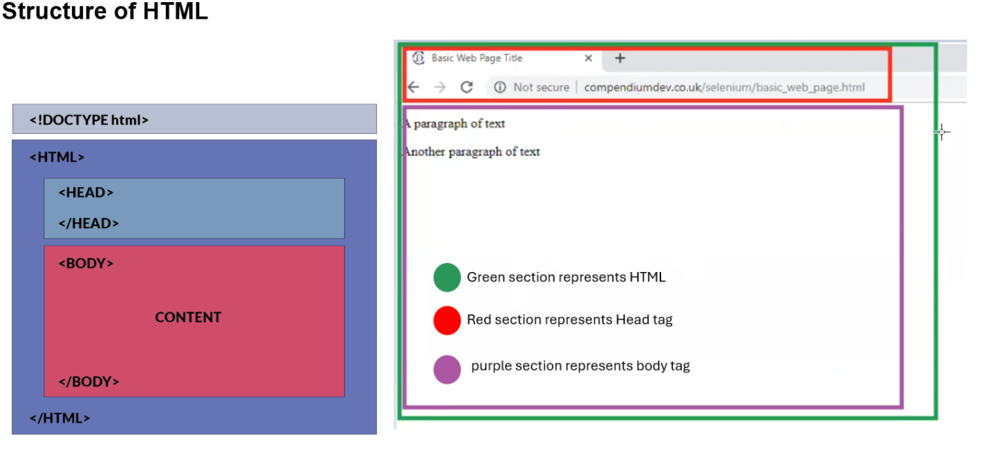

What is HTML?
> HTML Stands for Hyper Text Markup Language.
> HTML is language, which is used to create web pages.
.
HTML Tags, Attributes names, Attribute values, Enclosed Text & HTML Elements.
> HTML Tags → 
 - - - - - - 

> Attribute Names → 
 - - - - - 

> Attribute Values → 
 - - - - - 

> enclosed text → 
 enclosed text yaha hota h  

> HTML Elements → 
 enclosed text yaha hota h  
  [everything from this line]

Structure of HTML
  

Adding paragraphs to the HTML web Page.
> we can add the paragraph using 
- - - -
 tag.

Text basics
> Bold text → <b> Your text </b>
> Italic text → <i> Your text </i>
> Underlined text → <u> Your text </u>

Heading sizes 
> 
Adding Hyperlink
> <a href=”Your link”> any random text aayega yaha jisme wo link embedded hogi </a>

Ruler tag
> 

Adding Image 
> 

Line breaks 
>  
