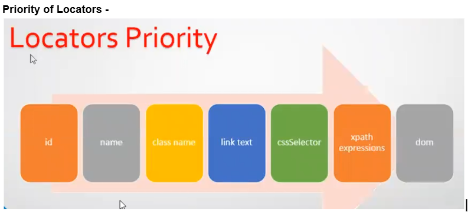

What are locators?
- Selenium is by default blind, as it doesn’t have any inbuilt capability or mechanism to locate any UI elements on the WebPages.
- In order to find UI elements on the Web Pages, Selenium has to take the help of locators.
- Locators are the  ones which actually locate the UI Elements on the web pages. 

<h1>Types of Locators </h1>

- ID → 
	- Syntax :  id=”button1”

- Name → 
	- Syntax : Name = value

- Class Name → 
	- Syntax : Class Name = Value  

- Link Text → 
	- Syntax : link = text between anchor tags <a>

- CSS Selectors → 
	- Syntax : css = css selector value

- Xpath Expression → 
	- Syntax : xpath = xpath expression

- DOM → Document object 
	- Syntax :  dom=document.getElementById(“value”) → we need add this syntax in console tab.

Priority of Locators -

