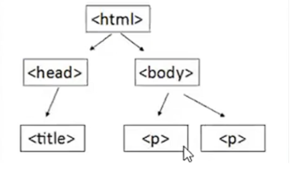
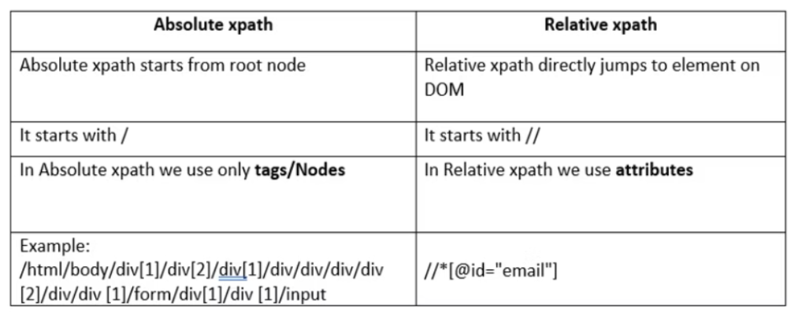
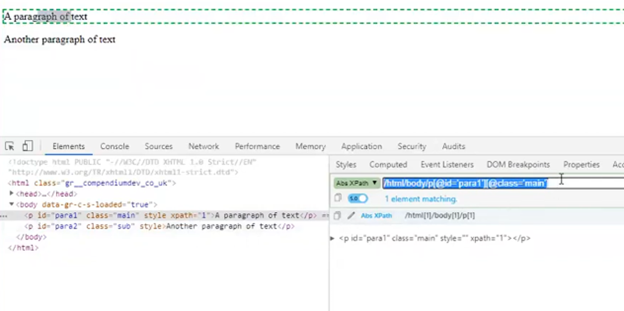
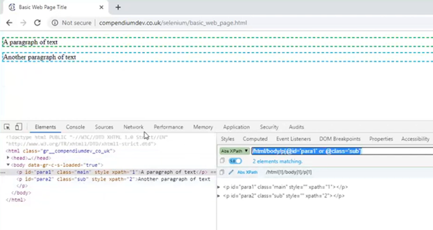
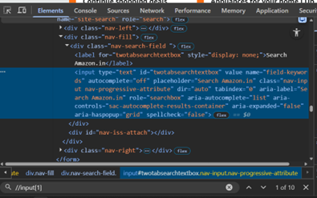
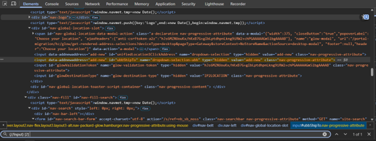

 What is an XPath ?  
- Xpath is a technical language used for traversing/navigating through XML documents.
- Purpose of XML and Xpath   
The purpose of XML is to communicate the details between two different systems.
- To retrieve the data stored via XML document, the XPath language can be used to navigate though the XML Document to the required node where data is stored.inshort (XML kind of common data h jo dono systems ko smjh aata h and wo data understand karne ke liye Xpath language ka use hota h).
- Xpath is XML Path Language.
- Xpath and HTML Traversing : it is possible because HTML follows the same structure of XML.

------------------------------------

Hierarchy of HTML Source code 

------------------------------------
Types of Xpath Expression -
* Absolute Xpath Expression
	- Complete path from Root element (not using in projects)
	- Starts with / “Single slash”
    -  /hrml/body/p[1] 
* Relative Xpath Expression
	- direct or shortcut path 
	- Starts with // (Double slash)
	- //p[1]

→ Attribute has to mentioned by [@attribute name=’value’]

------------------------------------
1). <b>Multiple condition</b> 
- yaha pe ID bhi match kiya and Class name bhi match kiya. 

2). <b> OR condition </b> 
-  Yaha ek hi square bracket me or daalke 2 conditions check krte h. Agar ek bhi match hoga to wo result dega.

------------------------------------

Advantages and Disadvantages of Absolute Xpath 
* {Advantage} Absolute Expression can locate the element faster 
* {Disadvantage} If any small change happens then the Xpath may not work.like kisi bich wale tag ch sequence change ho gaya to yaha fail hoga.
------------------------------------
Relative XPath Expressions 
- SET 1
    - Relative XPath Expressions means Direct path towards the UI Element.
    - Relative Xpath Expression starts with // slash.
    - The same Set of combinations can be followed here Like  
	- 1). Multiple condition 
		- → //input[@name=’value’][@class=’value’]
	- 2). OR condition 
		→ //input[@name=’value’ or @class=’value’]

____
- SET 2
    - Indexing 
        - Example : URL : https://www.amazon.in/

//input[1]  vs (//Input) [2] 

//input[1] 

👈hya madhye mala 10 results milale reason is, 
//input[1] jevha mi search kela tevha tyacha parent tag mhnje div madhye jevdhe pn input tags aale aahet te srv milale. Means purn page vr jevdhe pn div tags aahet jyat fkt 1 input tag aahe ashe total 10 results available aahet te yetil. 
Basically hya syntax madhye parent tag vr result decide hoto. 

Pn jar ata 1 chya jaagi mi 2 lihila tr. mala tevdhech results miltil jevdhya div tags madhye 2 input tag aahet. 
Jar 5 number lihila tr kahich milnar nahi coz, maximum hya page madhye div madhye 4 input tags aahet.

(//Input)[2] 

👆ata hya case madhye apn (//Input) [2] cha second index dila aahe mean.overall input tag cha second index. Tya mule ekach result milala. 

4). and Operator 
//input[@name=’’value’ and @class=’value’]

Extras : 
//input[@checked] 
	→ it will give us all the checked checkbox elements. From the input tag.

----------------------------

SET 3
//img[@height=’200px’]
	→ Agar image find karni h aur kuch attributes naa mile to hieght aur width le sakte h.

5).Pipe Operator
-	Xpath Expression 1 | Xpath Expression 2
	→ kabhi kabhi aisa hota h ki ek hi field me 2 properties hoti h bohat rarely. Like aaj 1st dikha rha h kal 2nd dikhayega to us case me ye use hota h. Like ye nhi to wo. And wo nhi to ye. 

- Syntax 
   - //input[@id=’1st’] | //input[@id=’2nd’] 
   -  //input[@id=’1st’ or @id=’2nd’]   ------>  dono same way me kaam karenge but ye wala jyada optimized rahega.

-------------------------------

SET 4
- Go to amazon.in cart page

Question : Locate all the tags having id attribute value as ‘but2’

6). All/Any tag
- // * [@id='but2']
- Basically yaha hum log ye karte h ki * matlab all hota h. Koi specific tag nhi like. Ab ye case me mujhe id=but2 value wale sare attributes chahiye to isiliye * use kiya.

Question : Locate all span tags having any attribute value as a-price-whole
- //span[@*='a-price-whole']
- isse hum attribute ko * pass kar rhe h so, attribute all/any scan honge with value as a ‘a-price-whole’ so basically jitne bhi attribute ka value ‘a-price-whole’ ye hoga span tag me wo sare locate honge.

Question : Locate span tags having id attribute value as anything. 
- //span[@id]
- value field me * nhi use kar sakte.

----

SET 5

 Question : Locate first span tag and second span tag having class attribute value as a ‘nav-a-content’

-  (//span[@class="nav-a-content"])[1] | (//span[@class="nav-a-content"])[2]
-  (//span[@class="nav-a-content"])[1] → yaha pe circular bracket use kiye coz wo different tag me h.
-  (//span[@class="nav-a-content"])[2]
- isme se koi bhi kar sakte h

Question : Locate all the tags in the webpage having class attribute with value as a nav-a-content
- //*[@class='nav-a-content']

Question : Locate all the tags in webpage having any attribute value as a ‘nav-a-content’
- //*[@*='nav-a-content']

Question : Locate all the tags in the webpage having any attribute and value as anything.
- //*[@*]

Question : Locate all the tags from the webpage having either id attribute value or name attribute 
- //*[@id or @name]
- //*[@id and @name] → isme dono attributes honge to hi result milega.

------------------------------------------------------

SET 6

Question : Locate all the hyperlinks in the page.
- //a
- coz generally hyperlinks anchor tag me hote h.

Question : Locate all the hyperlinks from the page that the href value as ‘https://www.facebook.com/AmazonIN’
- //a[@href=’https://www.facebook.com/AmazonIN’]

Question : Difference between with () and Without () in the above example
- With () → wo Page level pe ho jaata h.
- Without () → Tag level pe work hota h.

------------------------------------------------------

SET 7

Question : Locate the first child of the ‘html’ tag
- //html/*[1]
- html me all tags bola and usme 1st index wala

Question : Locate the second child of the ‘html’ tag
- //html/*[2]
- yaha pe multiple results bhi aayenga coz child tag multiple ho sakte h.

Question : Using // in between the relative Xpath Expression 
- //html//p[@id='mars-video-widget-158255317698210097_component_435_description']
- directly shortcuts ki tarah use kar sakte h. 

-------------------------------------------------------

<h1>Xpath Expression - Wild Cards</h1>

1). *  → iska use to pata h hume * dalne se wo tag hume any/all tag smjhate h.
	→ * hume kisi Tag / Attribute ko replace karne ke liye use karte h.

2). node()
→ Node bas tag ko replace karne ke liye use hota h. 
→ Rarely used, better to have knowledge of it.
→ node() end me use nhi kar sakte. Bich me hi use kar sakte h. Bas tag ko hi replace karte h.

Xpath Expression - HTML Table
https://omayo.blogspot.com/
→ //table
→ //table[@id='table1']
→ //table[@id='table1']//tr → for all rows 
→ //table[@id='table1']//th → hyane fkt Heading locate hotil.
→ //table[@id='table1']//td → hyane purn table cha data locate hoto. Heading nhi fkt data.

Question : Find all the cells in the table (i.e. table headings + table data)
→//table[@id='table1']//th | //table[@id='table1']//td

Question : Find the second data row and third column
→ //table[@id='table1']//tr[2] //td[3]

--------------------------------------------

Different Xpath Functions

1). text() 
- text() = . → text() ko .dot se bhi likh sakte h.
- //span[text()='Samsung Mobile'] → so basically text se xpath dhundega
- //span[.=’Samsung Mobile’]
- cannot use this text() function. Jab tags me text nhi hoga.

2). contains() 
- //span[contains(text(),'Samsung')] → yaha text ke baad = nhi lagta.basically contains() function me = ke jage pe , use hota h.
- //span[contains(.,'Samsung')] → ab yaha text() ko .dot se replace kar diya.
- //a[contains(@id,'nav-logo-sprites')] 
	- aise bhi kar sakte h. Like yaha contains function me attribute and value pass ki h. Aur 
	Haa value pura nhi likha fir bhi chalta h. Like ‘'nav-logo’ aise bhi likhu to chalega.

3).starts-with()
- //span[starts-with(.,'Under')] 
	- basically text ki starting kaha se karni h uske hisab se locate karega.
	- jaruri nhi ki pura text dena pade. 
- //a[starts-with(@id,'nav-logo-sprites')] 
	- ye attribute ka h. Isse amazon ke logo ko locate karega.
- //a[starts-with(@id,'nav-logo-sprites')] 
	- aise bhi kar sakte h. Like yaha contains function me attribute and value pass ki h. Aur 
	Haa value pura nhi likha fir bhi chalta h. Like ‘'nav-logo’ aise bhi likhu to chalega.

4). last()
	→ //a[last()] → last wala jo hoga wo locate hoga.
	→ //a[last()-1] → second last locate hoga.

5). Position()
	→  //a[position()=1] 
		→ yaa fir jo indexing karte h hum log wo bhi same work karega.
	→ //a[position()=2]

-------

Different Xpath AXES
- so basically yaha pe hum log ye dekh rahe h ki. Let’s say ek page pe 2 elements h. Usme se ek element locate nhi ho rha h with xpath aur koi bhi locators se. To jo 2nd element h wo uske near by hoga. To uski help leke locate karenge. Jise hum Xpath AXES kehte h.

1). Following Xpath AXES
- //span/following::div 
	- isme following tag wo h jo locate ho rha h. But div tag wo h jo dhundna h. So basically 
	Reference tag aur target tag daalne h.
	- //body/div/following::div → isme div side wala div find kiya.
	- isme koi bhi tag locate kar sakte h like child,parent.

2). Preceding Xpath AXES
- ye following XPath AXES ka opposite hoga. I mean jo tag hum denge usko pehle wala tag locate karega.
- //a[@data-csa-c-content-id="nav_cs_mobiles"]/preceding::script
	→ bas preceding:: word daalke tags name add krne h like following jaise.

3). Following-sibling Xpath AXES
- //head/following-sibling::body
	- Isme bas usi level ke locate hoge.
	- one more thing. Tag uske level wala hoga to hi locate hoga. Uske under ya bahar    wala nhi.

4). preceding-sibling Xpath AXES
- //body/preceding-sibling::head
	- Following-sibiling ka ulata.baaki sab same.

5). Parent Xpath AXES 
	- //body/parent::html
		- isse bas parent tag locate kar sakte h.

6). Child Xpath AXES 
	- //html/child::body
	- //html/child::head
		- Child tags locate kar sakte h.

7). ancestor Xpath AXES 
    - //span/ancestor::html

8). descendent Xpath AXES
    - //html/descendent::span

-----------

Advantages of relative Xpath Expressions. 
- it is very reliable and helpful. 