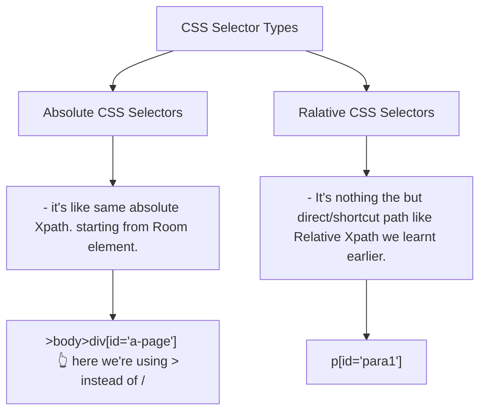

# CSS (Cascading style sheet)
- helps to buetify the html page(color, size, Font family, background color).

<h4> <u> CSS Selectors </u> </h4>

- Syntax ----> img[width="260"]  
        - in css selectors we're not adding // and @ 

------------------------------

<h4> <u>CSS Selector Types </u> </h4>

------------------------------

# Relative CSS Selectors - First Set of Examples

- html ---> it will locate the Html tag.
- body ---> this is will locate the title tag.
- p[id='para1'] ---> it will locate the id with para1 value. *(aslo to make it more short we can replace id with #)*
- p#para2 ---> it will locate the same.
- p.para2 ---> so basically class will be getting replaced by *.dot*
- p[id='para1'][class='sub']
  
------------------------------

 

# Relative CSS Selectors - Second Set of Examples
- 