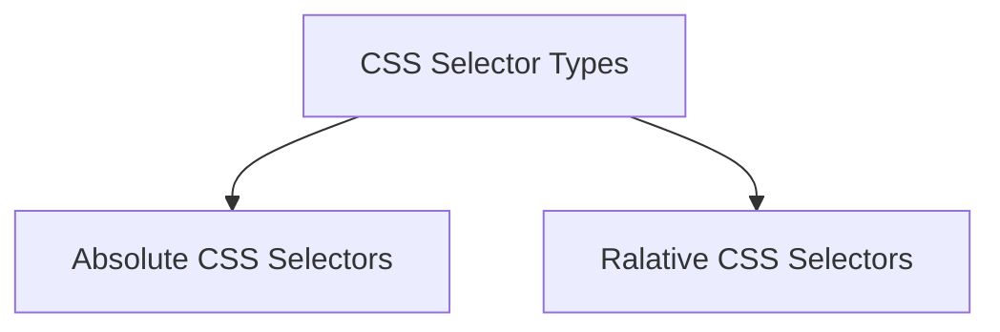

# CSS (Cascading style sheet)
- helps to buetify the html page(color, size, Font family, background color).

<h4> <u> CSS Selectors </u> </h4>

- Syntax ----> img[width="260"]  
        - in css selectors we're not adding // and @ 

------------------------------

<h4> <u>CSS Selector Types </u> </h4>

------------------------------

1). Absolute CSS Selectors 

