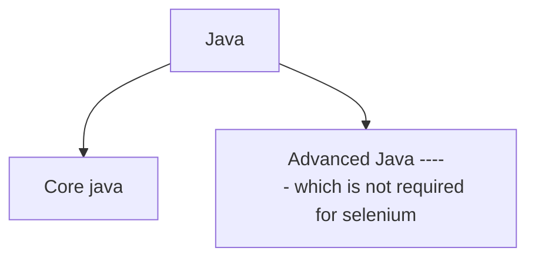
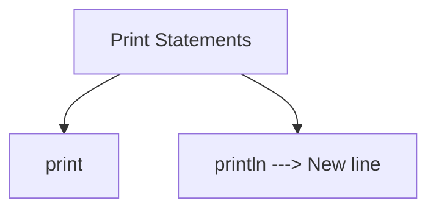
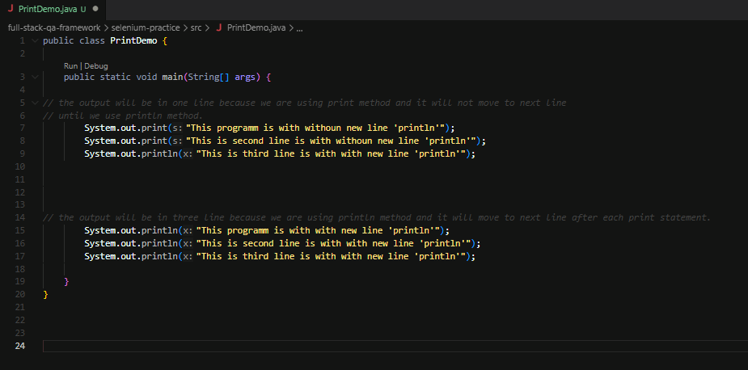
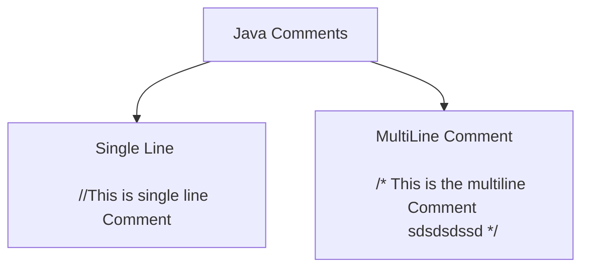
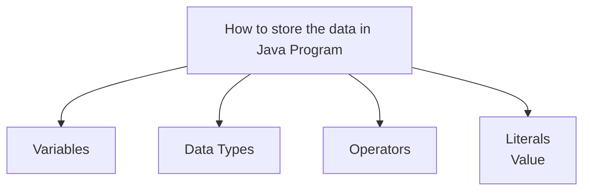
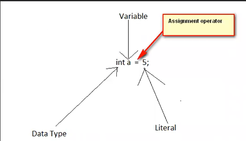
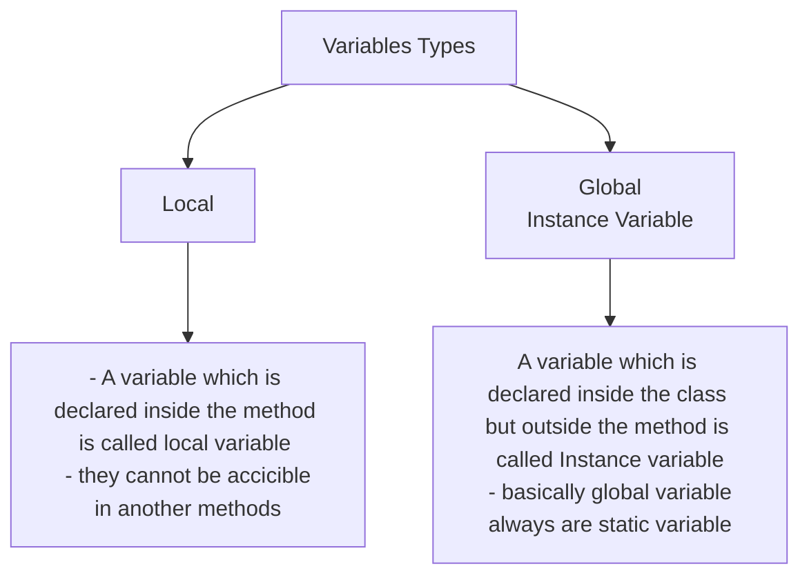

# Introduction to Java

- java is a programming language.
- Java can be devided into two types.

<h3> Installation : </h3>

  1). Download JDK --> install --> configure bin folder path in Enviromant variable --> check the version (java --version) 

  2). Download any IDE and install  

  3). check the Java version in terminal of the IDE*(Integrated Developement environment).*

<h2>Java Project Creation & Execution </h2>

- The below are the steps for creating a Java Project in Eclipse IDE:
- Right click in the 'Project Explorer' and select 'New > Project > Java Project'
- Provide 'Project Name' and click on 'Finish' button
- Right click on the 'src' folder and select 'New > Class'
- Provide 'Class Name', select the checkbox for main method and click on 'Finish' button
- Write a sample Java statement - System.out.println("Hello World!");
- Right click on the .java file and select 'Run As > Java Application' to execute the Java program

<h2> Understanding the Java Program</h2>

- In java program, we've to enclose everything inside the a Class.
  - Syntax --> public class ClassName { }
  - This class term is used as syntax to create/define a Class in Java
- In Java programs, execution starts from the main method
  - Syntax of main() method - public static void main(String args[]){ }
- All the Java statements in Java should end with ';' symbol
  - Example for a Java Statement is nothing but print statement - System.out.println("Hello World");
- All the Java statements should be written inside the methods
    - We generally write code which is nothing but a set of statements inside the methods
- Keywords like public, static, void and String args[] will be explained later

<h2>Compiler Errors </h2>
- Java Complier Errors will be displayed when we make syntax mistakes in the Java Code:

- Example: All the Java statements in Java should end with ';' symbol
    - Remove the ; from the end of Java Statement
- Example: Java is case sensitive
    - Replace 'S' with 's' in the statement
- Example: Remove any of the closing braces.

<h2>Java Print statements </h2>

- Print statement in Java used to print data in console.
 

- 

- For Printing characters the double quotes are needed.
- For Printing the Number not quotes are needed.
- 

<h2>Comments </h2>

- Comments started in JAVA by // 
- We can write the comments anywhere in the program.
  - Single Line comments :
    - //This is a sample comment for Single line comment.
  - Multi Line comments :
    - /* This is the multi line Cooment   
    lkasjdlkasdlaksdalsdaknsd */
 

<h2>Variables, Data Types, Operators and Literals</h2>

-  

<h2>Variables</h2>

~~~ 

**Local Variable **

  public static void localVariable () {
        int t = 5213;
        System.out.println(t);
    }

~~~

~~~ 

**Global / Instance Variable **

  static int t = 5213;

  public static void localVariable () { 
        System.out.println(t);
    }

// here the only catch is in the static method only static variable will work.
- Meaning was to use the variable in static methid we need to make that variable static.
~~~
