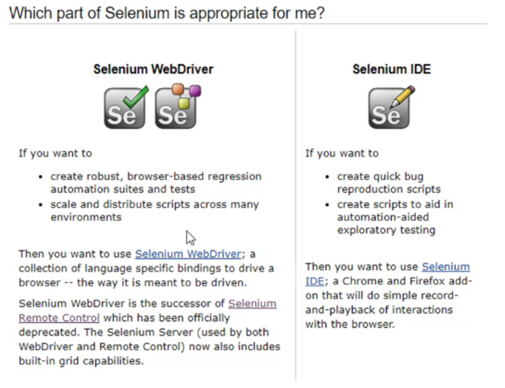
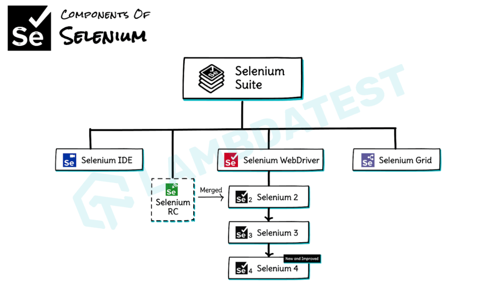
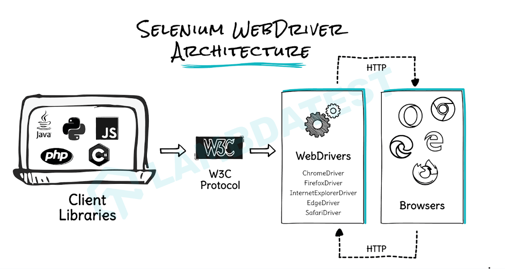
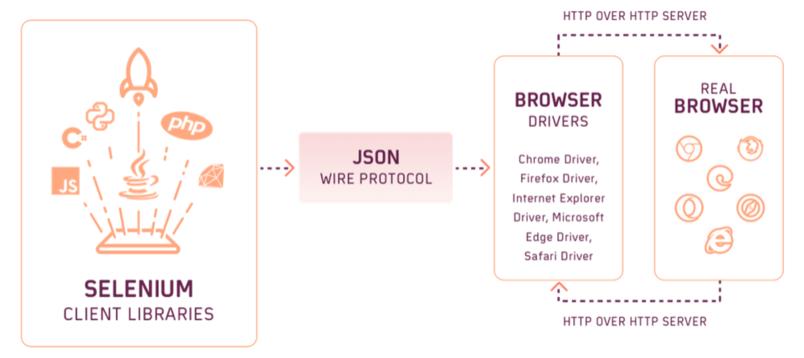
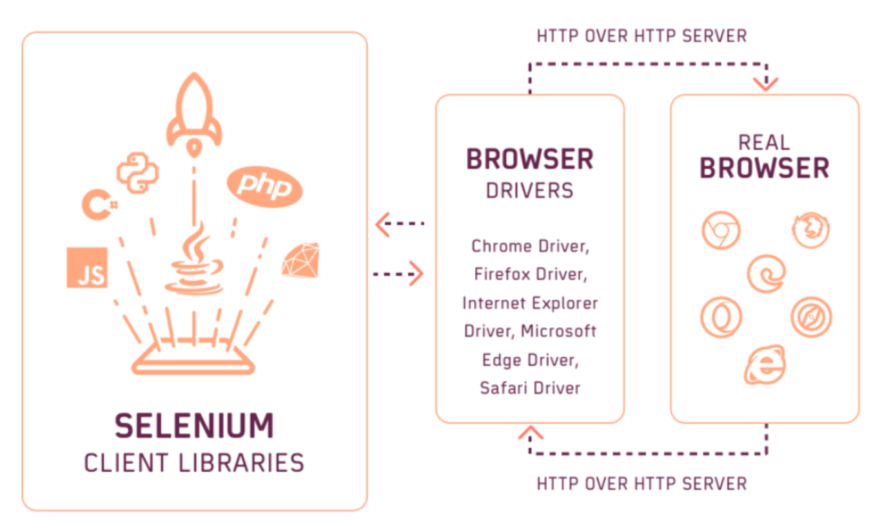

<h4> Selenium Features </h4>

1). Selenium is an Open source Automation tool.  
2). Only for Web Based Applications. 
3). Supports multiple Browsers - Chrome / Firefox / IE / Safari / Opera  
4). Supports Multiple Platforms - Windows / Mac OS / Linux  
5). Supports Multiple Languages - JAVA / Python / C# / JavaScript / Php / Ruby 

6). Difference between Selenium and WebDriver ? 
- Selenium is a suite of tools to automate web browsers across many platforms.		
- have 2 major tools : Selenium WebDriver and Selenium IDE. 
- with Selenium WebDriver we can use  ( Selenium Grid is a component of Selenium that allows you to execute tests in parallel** across multiple machines and browsers).

7). Components of Selenium -

<i><b>Bonus :</b> Selenium WebDriver and Selenium RC were merged into one single unit called Selenium 2.0 or Selenium WebDriver 2.0.</i>

-----

<h4> Selenium WebDriver Architecture </h4>

Selenium Client Libraries:
> A Selenium Client Library is nothing but a different kind of Jar file. It contains methods and classes of Selenium WebDriver that are required to create test automation scripts.

What is Browser driver :
>  Each Browser (Chrome, Firefox, Safari, etc.) has its own dedicated driver. This driver is a small program that acts as a translator between the WebDriver protocol and the Browser.

| Version | Communication Protocol | Description |
| -------- | -------- | -------- |
| Selenium RC | Custom RC Server | Slow, outdated |
| Selenium 2&3 | JSON Wire Protocol | Client → JSON → HTTP → Driver |
|  Selenium 4 | W3C WebDriver Protocol | Direct W3C call, faster & stable  |

---

 
<h4>Selenium 2.0 & 3.0</h4>

In Selenium 3.0, the primary mode of communication between the automation test script and web browser was the JSON Wire protocol.
- Client libraries send automation commands using the JSON Wire Protocol.
- These commands are converted into HTTP requests and sent to the browser driver.
- The browser driver processes the requests and executes them on the browser.

<h4>Selenium 4.0</h4>

- Client libraries communicate directly(http request) with the browser driver using the W3C(World Wide Web   Consortium) WebDriver Protocol.
- The JSON conversion layer is removed, ensuring faster, more stable, and standardized browser

 
Why W3C WebDriver Protocol ?? 

 - All Modern browsers (Chrome, Firefox, Safari, Edge) natively support the W3C Protocol. Meant is at the backend our the W3C protocol will Call GET /seesion/{session id}/url 