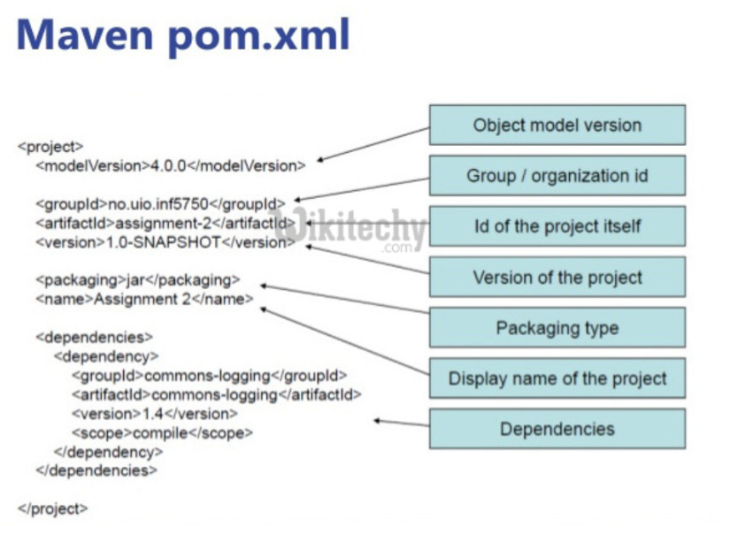
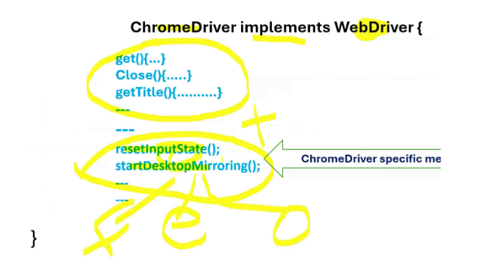

<h4>Install Java & Eclipse - Setup Maven Project from Scratch </h4>

1). Download JDK and install. 

    Windows : 
    - Copy the JDK Home path from Program files.
	- Go to the  Environment variables and add system variables.
	- now locate JDK Home and copy the Path of Bin directory path and add that in the Path option in System variable.
		
    Mac OS :
	- Download the DMG installer if the system has an M1 series chipset. 
	- Download if Mac has intel based chipset.
	- to make the system variables in mac there is a file called  .zshrc(this file is responsible for storing all the environment variables).
	- to check the JAVA Installed directory in Mac use Command : /usr/libexec/java_home -V
	- now go to .zshrc file and add the Path : 
			Eg. export JAVA_HOME=Path address
	- to save that file give command as :wq once it is done.
	- to preserve the changes add command - source ~/.zshrc
	
2). Setting up Eclipse Maven Project with Selenium dependencies from Scratch

	- Download Eclipse and install it. 
	- create a new Maven project.
	- What is Maven??
	    - Maven is a Central repository where all the JAVA related Libraries/JARS were stored. We can use that for our needs. By simply calling the dependencies in our project.
		- Add Group id as -> this is the Organization you’re in.
		- Artifact ID means this is the project you’re working on.
		- once the Maven project is created pom.xml(Heart of the project) file will get created.
		- add the Dependency in the pom.xml. ( this is how we can add JAR files in the project).

3).Understanding the core concept of Browser driver classes and Webdriver Interface.
> Invoking the Browser.
There are 2 ways to invoke the Browser 
- 		1). By passing the Browser driver locally
			- Download the Browser driver manually and add declare it in script. 
			Eg. System.setProperty(“webdriver.chrome.driver”, “path/chromedriver.exe”);
- 		2). By With Selenium manager : 
			- WebDriver driver = new ChromeDriver (); 
			-  This streamlines the setup process, allowing your Selenium scripts to run smoothly without requiring you to configure or update driver paths yourself. When Selenium Manager downloads a driver, it typically stores it in a standard location within the user directory on your system (such as .cache/selenium on Linux, or similar cache folders on Windows and Mac). Selenium Manager manages these drivers internally, so you don’t have to worry about finding or updating them—everything is handled for you behind the scenes
WebDriver (Interface)
//Chrome - ChromeDriver -> methods : Close , get, quite…
//Firefox - FirefoxDriver -> methods : Close , get, quite…
//Safari - SafariDriver -> methods : Close , get, quite…

> What is Interface in Java?? - 
- Is a Group of related methods with empty bodies. Basically Interface enforces the contract to class to follow. 
- When we’re writing the methods by calling the constructor its class responsibility to  implement the methods declared in the interface. [In simple WebDriver will give only method names with empty bodies, the main contents of the method will be provided by class (ChromeDriver ,FirefoxDriver . SafariDriver etc )]
	> 2 methods (with selenium manager and with .setProperties by downloading the browserdriver)

1. What is Interface in Java?
An interface is a group of related methods with empty bodies. Its class responsibility to implement the methods declared in the Interface When class agreed to implement the interface, they must need to provide implementation/bodies to all the defined methods in Interface
In simple terms, Interface enforces the Contract to class to follow.

2. WebDriver is an Interface which provides Set of Browser Automation methods with empty bodies (Abstract methods) Classes like ChromeDriver, FirefoxDriver, MicrosoftEdgeDriver, SafariDriver etc implement the WebDriver Interface and provide their own implementation to the WebDriver methods

3. We need to create the object of the class to access the methods present in the class. 
   
- ChromeDriver driver = new ChromeDriver ();  
driver object here has access to all the methods of Chrome driver ( Reason is if we used this then only ChromeDriver methods are accessible and some methods are only specific to ChromeDriver() which are not entertained by others like Geckodriver() , OperaDriver(), SafariDriver() - so in that case the written script will  might get failed).
- WebDriver driver = new ChromeDriver ();  
driver object here has access to the methods of Chrome driver which are defined in the web driver interface.- but where as if we used this webDriver will provide those methods which are supported by all the Browser drivers like ChromeDriver(), Geckodriver() , OperaDriver(), SafariDriver() etc. so the entire code will run on any supported browser. Without any issue,

