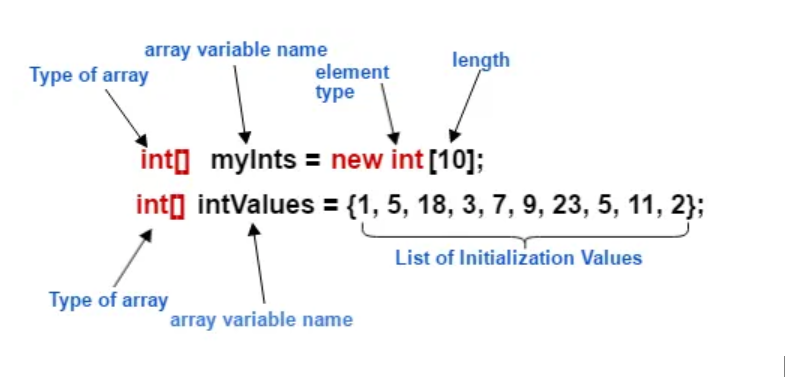
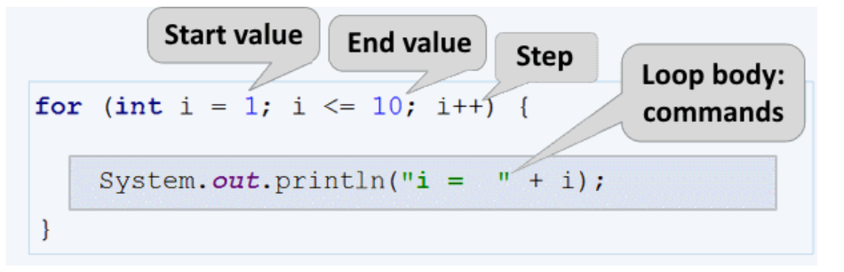

 Introduction to Java variables and Data types with examples- 

# Variables & Datatypes Summary with Example
- Variables store data in your program, like numbers, text, or logical values.
- Every variable must be declared with a datatype that tells Java what kind of data it holds (e.g., integer, text).

Data Types : 
- int age = 22; 
- char grade = 'B';
- boolean isActive = false;
- String name = "Tanmay Suresh Ninawe";		
- float height = 5.7f;  		→  Use 'f' for - float values.  Decimal values can be stored in both data types.
- double salary = 60000.75;             → Decimal values can be stored in both data types.

// String concatenation
- System.out.println(Name + " this is my Full name stored in Name variable");

# Arrays : 
- Arrays can store multiple values in a single variable. 
- Syntax : they’re 2 method to initialize array 	
> Method 1 : 
-   int[] arrayName = new int[10]; 
	- 		→ here arrayName is Variable name.
	- 		→ int[] : we;re telling java this is an array of integer datatypes.
	- 		→ new : is a memory allocation for this array. 
	-		→ int[5] : this is the length. Or this array will hold 10 values .
// assigning the values in array index
int[] arrayName = new int[10]; 
arrayName[0] = 1;
arrayName[1] = 5;
arrayName[2] = 18;
		|
		|
arrayName[9] = 2;

Method 2 : 

Int[] intValues = {1, 5, 18, 3 ……., 11, 2};
		→ to access the items from this given array use 
			System.out.println(intValues[2]);  
				→ output will be 18 as because at 2nd index 18 is there in array

# Loops:
1). For Loop : 
- Syntax : 		

        for(int i=0; i<arrayName.length; i++)	
			{  
				System.out.println(arrayName[i]);  
			}	

→ int i = 0 → Start at the first position.  
→ i < arrayName.length → Stop at the last item. OR i<10 (if we know the end point)  
→ i++ → Move to the next item each time. 
→ so this will print all the available values from the array.

2). Enhance For Loop :  
	Syntax : 	

			    for(String s : arrStrng)
			        {
				System.out.println(s);
			        }
→ This loop is an easy way to go through all the items in an array.  
→ It automatically handles the starting and ending points. 
→ String s : Each time, s is set to the next item in the array. 
→ : arrStrng : Go through every value in the array called arrStrng. 

3). If - else condictions.